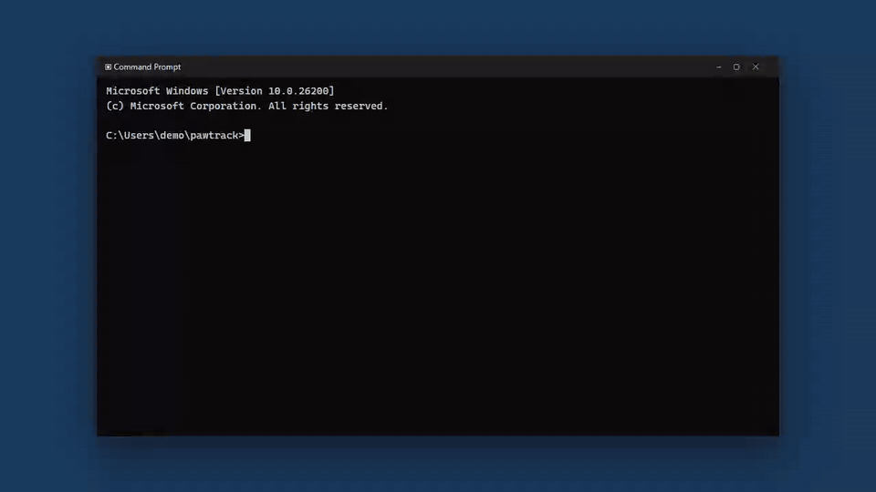

# Sherlock — local AI QA workspace for Claude Code

Turn PRDs into traceable QA guides with Claude Code: local-first, with an editor in English and Hebrew.



## Overview

Sherlock turns a product requirements document (PRD) into a QA guide you can review and trace
back to its source. You give Claude Code a PRD (`.docx`, `.pdf` or `.md`). Claude reads it the
way a QA engineer would and writes a structured QA model: requirements, screens, flows,
actions, validations, business rules, states, permissions, test cases and open gaps. Each item
cites the PRD section and quote it came from, and Sherlock checks every quote against the PRD.

Sherlock then opens the model in a local editor in your browser. There you review coverage and
traceability, search everything with Spotlight (`Ctrl/⌘K`), and leave feedback on any item.
Claude picks the feedback up, patches the model, and the page refreshes live. The editor
supports English and Hebrew (full RTL). Everything stays on your machine: no cloud service,
no database.

**Claude is the intelligence. Sherlock is the workspace and the agent interface.**

## Usage

1. Install once (see [Setup](#setup)): `npm install && npm run build && npm run setup`.
2. In any project, in Claude Code:

   ```
   /sherlock path/to/prd.docx
   ```

   Claude extracts the PRD, writes and validates the model, and opens the editor.
3. Review in the browser: check coverage, open items in the inspector, jump to the quoted PRD
   text, and use **Send to Claude** to leave feedback.
4. Ask Claude to process the feedback (or leave it polling). It applies the changes with
   `sherlock update … --resolve FB-001`, and the editor updates live.

You can also run the CLI yourself. The commands are listed below and in [CLI](#cli).

### Commands

| Command | What it does |
|---|---|
| `sherlock analyze <prd>` | Extract a .docx/.pdf/.md PRD into `.sherlock/prd.md`, with anchored sections |
| `sherlock create <model.json\|dir>` | Validate and install the first QA model |
| `sherlock update <model\|patch\|dir> [--resolve FB-1 --note "…"]` | Apply a full model or a patch, and resolve feedback |
| `sherlock validate [file\|dir]` | Dry-run validation: structure, links, quoted excerpts |
| `sherlock inspect` | Compact status: counts, coverage, traceability, open gaps and feedback |
| `sherlock show <ID…>` | One or more entities with their links and sources |
| `sherlock open [--focus ID] [--no-browser]` | Start the local server and open the editor |
| `sherlock stop` | Stop this workspace's server |
| `sherlock feedback [--all]` | List QA feedback |
| `sherlock poll` | Wait for new QA feedback |
| `sherlock resolve <FB-ID…> [--dismiss]` | Mark feedback resolved or dismissed |
| `sherlock eval <golden.json> [model]` | Regression: concept recall against a golden QA guide |
| `sherlock setup [--project]` | Install the Claude Code skill |

Repo scripts:

| Script | What it does |
|---|---|
| `npm run build` | Build the editor (Next.js static export into `apps/editor/out`) |
| `npm test` | Unit tests: model, CLI, server, PDF extraction, editor i18n and search |
| `npm run setup` | Install the skill into `~/.claude/skills/sherlock` |
| `npm run dev:editor` | Editor dev server on :4871, proxying to a running `sherlock open` |
| `npm run lint:i18n` | Fail on hard-coded UI strings or physical left/right CSS |
| `npm run e2e -w @sherlock/editor` | Playwright end-to-end checks (needs a build and a local workspace) |

## Setup

Requires Node ≥ 18.17. Tested on Windows 11 with Node 22 (PowerShell and Git Bash).

```bash
npm install          # workspaces: cli, editor, qa-model (pdfjs-dist is optional, for PDFs)
npm run build        # builds the editor: Next.js static export → apps/editor/out
npm test             # node --test: model, CLI, server API, PDF + real-PRD extraction
npm run setup        # installs the Claude Code skill into ~/.claude/skills/sherlock
                     # (Windows: %USERPROFILE%\.claude\skills\sherlock)
```

`setup` writes the skill with an absolute CLI path (`node "E:/…/apps/cli/bin/sherlock.js"`),
so Claude can run Sherlock from any project without relying on PATH. Use
`node apps/cli/bin/sherlock.js setup --project` to install into `./.claude/skills` instead.
Run `npm run setup` again after you move the repo or edit `skills/sherlock/SKILL.md`.

Then, in any project in Claude Code: `/sherlock path/to/prd.docx`.

### `sherlock` on your PATH

```bash
npm link -w @sherlock/cli     # creates sherlock / sherlock.cmd / sherlock.ps1 shims in the npm prefix
sherlock help
npm unlink -g @sherlock/cli   # to remove
```

On Windows the shims are written to `%APPDATA%\npm`. That folder must be on PATH, which the
Node installer sets up by default. If PowerShell refuses `sherlock.ps1` because of its
execution policy, run `sherlock.cmd`, or run `Set-ExecutionPolicy -Scope CurrentUser RemoteSigned`.

## How it works

```
PRD (.docx/.pdf/.md)
  │  sherlock analyze   → .sherlock/prd.md   (sections anchored [§3.8], [§9.3/4] …)
  ▼
Claude (skill)          → reads prd.md, reasons as a QA engineer, writes model JSON
  │  sherlock create    → validates structure, links and every quoted PRD excerpt
  ▼
.sherlock/model.json    ← source of truth
  │  sherlock open      → local server (JSON API + live reload) + browser
  ▼
Editor (Next.js)        → overview, lists, inspector, PRD source view, feedback
  │  QA feedback        → .sherlock/feedback.json
  ▼
sherlock poll/feedback  → Claude patches the model: sherlock update patch.json --resolve FB-001
```

| Part | Path | Responsibility |
|---|---|---|
| Skill | `skills/sherlock/SKILL.md` | Teaches Claude the loop, the model format and the provenance rules |
| CLI (AXI) | `apps/cli` | PRD extraction, validation, storage, local server, feedback. Output is compact and agent-first |
| Editor | `apps/editor` | Renders the model. It has no QA logic |
| QA model | `packages/qa-model` | Schema, validation, traceability graph, coverage, provenance checks, patches, golden eval |

### Workspace (`.sherlock/`, next to where you run Claude)

`prd.md` / `prd.json` (extracted PRD) · `model.json` (the QA model) · `feedback.json` ·
`project.json` (revision and change log) · `history/` (previous revisions) · `server.json`

## CLI

```
sherlock analyze <prd>                 extract PRD → .sherlock/prd.md
sherlock create <model.json|dir>       validate + install the first model
sherlock update <model|patch|dir> [--resolve FB-1 --note "…"]
sherlock validate [file|dir]           dry run
sherlock inspect | show <ID…>          compact status / one entity with links and sources
sherlock open [--focus ID] | stop      local server + browser
sherlock feedback | poll | resolve     QA feedback loop
sherlock eval <golden.json> [model]    regression: concept recall against a golden QA guide
```

Every command supports `--json`. Exit codes: 0 ok · 1 usage · 2 invalid · 3 not found · 4 server · 5 extraction.
Errors are printed to stdout in the same structured form (`ERROR CODE`, fields, message,
`NEXT:`), so an agent can always parse the result.

A directory argument (e.g. `.sherlock/parts/`) is merged in file-name order: arrays
concatenate and `project` merges. This is how a large model gets written and fixed in pieces.

## Trust features

- **Classification**: every item is `explicit`, `derived`, `inferred` or `ambiguous`. An ambiguous item must link to a gap.
- **Verified provenance**: every quoted excerpt is checked against the PRD text, including Hebrew and other RTL text,
  tables and headings. Items whose quote can't be found are flagged in the UI and in the CLI.
- **Coverage**: a requirement is *covered* when it has tests and every validation and rule linked to it is tested.
  It is *partial* when some of those have no test, and *uncovered* when it has no tests at all.

## Golden fixture

Real PRDs and their QA guides are local only: `fixtures/` is gitignored and never committed.
Put a golden set in `fixtures/<name>/` (the PRD, its human-written QA guide, and a `golden.json`
listing the QA concepts the guide covers). After Claude generates a model:

```bash
sherlock eval fixtures/<name>/golden.json    # GOLDEN PASS at ≥ 85% concept recall
```

The golden-fixture tests (`apps/cli/test/grants-fixture.test.js`) and the editor e2e run
(`npm run e2e -w @sherlock/editor`, workspace in `fixtures/grants/workspace/` or
`SHERLOCK_E2E_WORKSPACE`) need that local data; the unit tests skip it when it's absent.
Mock PDFs for the extraction tests are generated on first run and are gitignored too.

Concepts match only when an entity names the specific behaviour (for example "restore" together with
"exhibit"), not just the feature name.

## Editor development

```bash
sherlock open --no-browser         # in a project with a .sherlock workspace (serves the API on :4870)
npm run dev:editor                 # Next dev on :4871, proxies /api (incl. the SSE stream) to :4870
```

If the server runs on another port, set `SHERLOCK_API=http://localhost:4871 npm run dev:editor`.
The CLI server serves `apps/editor/out` straight from disk, so run `npm run build` and reload the page.
There's no need to restart the server.

## Troubleshooting

| Symptom | Fix |
|---|---|
| `ERROR EDITOR_NOT_BUILT` on `sherlock open` | Run `npm run build` in the repo. |
| Browser didn't open (`BROWSER: not opened`) | Open the printed URL yourself. It opens with `cmd /c start` on Windows, `open` on macOS and `xdg-open` on Linux. Set `SHERLOCK_NO_BROWSER=1` to suppress it. |
| Port 4870 is taken | `open` tries the next 40 ports and prints the one it used. `--port N` picks one. |
| A second server started for the same project | Upgrade: servers are now matched to their workspace case-insensitively on Windows. Run `sherlock stop` in each project. |
| `sherlock stop` says not running, but the page still loads | That page is a different workspace's server. Run `sherlock inspect` in that project; its URL line shows the server it owns. |
| `ERROR SERVER_START_FAILED` | Check `.sherlock/server.log`. |
| `ERROR WORKSPACE_LOCKED` | Another Sherlock process is writing `feedback.json`. Retry. A lock older than 10 s is taken over automatically. |
| `ERROR EXTRACT_FAILED` / `PRD_EMPTY` on a PDF | The PDF is corrupt or scanned (no text layer). Export the PRD as .docx or .md. |
| `SOURCE_SECTION_MISMATCH` warnings | The quote is real but belongs to a sub-section. Use the id the warning suggests. |
| Editor shows "Local server not reachable" | The server stopped. Run `sherlock open` again; the page reconnects by itself. |

Files are written atomically (temp file + rename, retried on Windows `EPERM`/`EBUSY`).
`feedback.json` is changed under a lock, because both the browser and the CLI write it.
